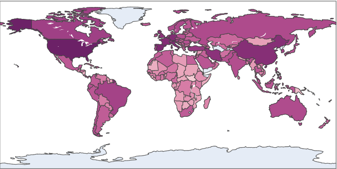
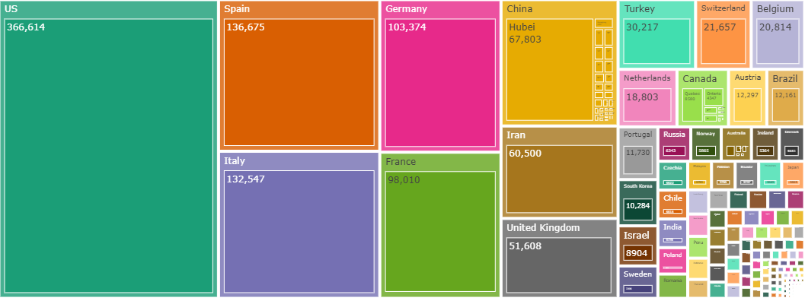
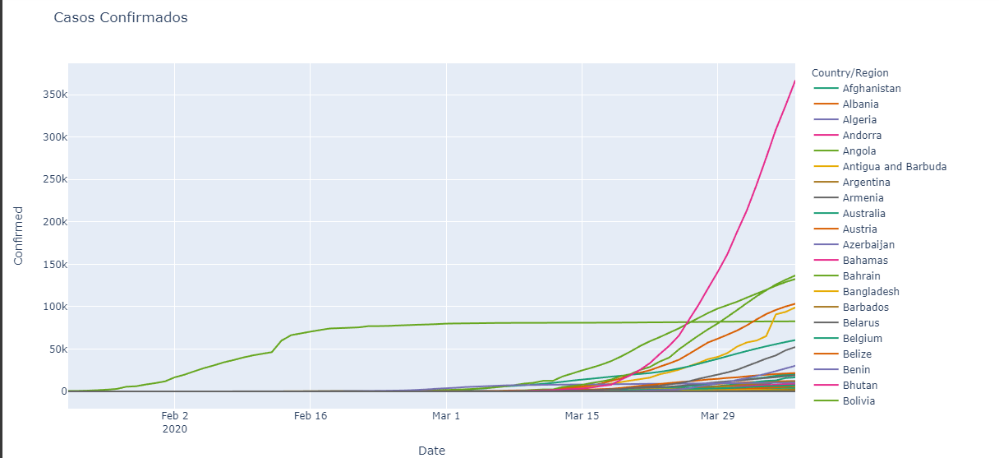
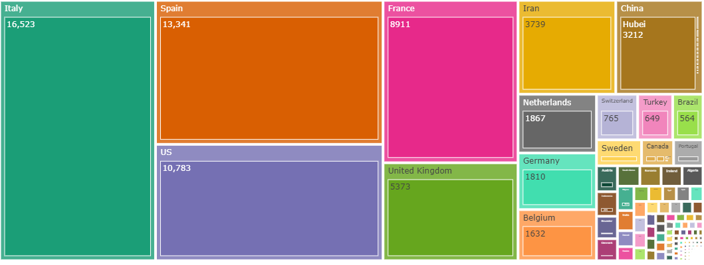
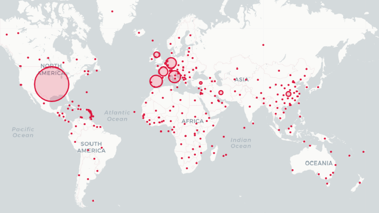

  

Por meio do portal da saúde do estado de SP o coronavírus (CoV) são uma grande família viral, conhecidos desde meados dos anos 1960, que causam infecções respiratórias em seres humanos e em animais. Geralmente, infecções por coronavírus causam doenças respiratórias leves a moderada, semelhantes a um resfriado comum. A maioria das pessoas se infecta com os coronavírus comuns ao longo da vida, sendo as crianças pequenas mais propensas a se infectarem. Os coronavírus comuns que infectam humanos são alpha coronavírus 229E e NL63 e beta coronavírus OC43, HKU1.

Em 2012, foi isolado outro novo coronavírus, distinto daquele que causou a SARS no começo da década passada. Esse novo coronavírus era desconhecido como agente de doença humana até sua identificação, inicialmente na Arábia Saudita e, posteriormente, em outros países do Oriente Médio, na Europa e na África. Todos os casos identificados fora da Península Arábica tinham histórico de viagem ou contato recente com viajantes procedentes de países do Oriente Médio – Arábia Saudita, Catar, Emirados Árabes e Jordânia.

                                      Sintomas

Através de pesquisas foi detectado que o  coronavírus humanos comuns causam infecções respiratórias brandas a moderadas de curta duração. Os sintomas podem envolver coriza, tosse, dor de garganta e febre. Esses vírus algumas vezes podem causar infecção das vias respiratórias inferiores, como pneumonia. Esse quadro é mais comum em pessoas com doenças cardiopulmonares, com sistema imunológico comprometido ou em idosos.

                                  Transmissão inter-humana
 
Todos os coronavírus são transmitidos de pessoa a pessoa, incluindo os SARS-CoV, porém sem transmissão sustentada. Com relação ao MERS-CoV, existem a OMS considera que há atualmente evidência bem documentada de transmissão de pessoa a pessoa, porém sem evidencias de que ocorra transmissão sustentada.


                                   Período de incubação

De 2 a 14 dias

_**FONTE**:http://www.saude.sp.gov.br/resources/cve-centro-de-vigilancia-epidemiologica/areas-de-vigilancia/doencas-de-transmissao-respiratoria/coronavirus.html_


# Analise de Dados sobre o Covid-19 Mundo.
Clauder Noronha Abril - 2020
O estudo pratico foi feito com os dados do Covid-19 no mês de abril, através do do site da FIOCRUZ https://portal.fiocruz.br/coronavirus .


Para fazer o tratamento dos dados foram utilizadas quatro bibliotecas. Pandas é uma biblioteca open source amplamente utilizada na comunidade acadêmica. Uma das caracteristicas do Pandas é o seu desempenho e pela sua capacidade de manipulação de dados.

Outra biblioteca foi o Numpy. É uma biblioteca para realizar cálculos em Arrays multidimensionai. Oferece um grande conjunto de funções e operações e executar cálculos numéricos.

PlotLy foi escolhida para criação de gráficos. Essa ferramenta tem a vantagen de fazer gráficos mais atraente e interativo. Através de um ambiente studio é possível salvar e editar os gráficos em nuvem utilizando uma interface web simples e intuitiva.

Base de Dados Covid-19
Com a mudança constante de numero casos confirmados e casos de óbitos, escolhemos a base de dados de abril de 2020 A base de dados é composto de 8 colunas é 19835 registros. Cada coluna é especificado por (Province/State, Country/Region, Lat, Long Date, Confirmed, Deaths, Recovered Active).

```python

df.head(5)
```
Vamos observar cinco primeira linha da base de dados do Covid-19 utlizando o comando head


```python
df.tail(5)
```

Vamos observar cinco ultmimas linhas da base de dados do Covid-19 utilizando o comando tail.


Estamos criando uma nova coluna, essa coluna vai ser criada para mostrar os casos ativos e o caso de morte.


### Dados Temporais


```python
df.Date.describe()
```
Utilizamos os dados temporais par asaber qual a data de inicio e a data do fim. Os dados temporais são diarios.


### Agrupamento de Dados

Foi preciso fazer uma agrupamento de dados para obter o numero de casos confirmados que foram recuperados e também pessoas que vieram a óbito.

```python
df.groupby
```


# Graficos

A Pandemia do novo coronavírus (Covid-19) já deixou mais de 45 mil mortos na Europa, dos quais cerca de 85% em Itália, Espanha e França.
Com um total de 46.033 mortos e 627.203 casos oficialmente declarados. A Europa é o continente mais afetado pela pandemia.

A parte mais escura do gráfico mostra o alto índice de caso de infectados do novo coronavírus.





Separamos cinco países, EUA, Espanha, Itália, China e Brasil. Vale lembrar que a data foi no dia 06/04/2020. Buscamos mostrar a quantidade de pessoas confirmada e a quantidade de pessoas mortas em cada país.


EUA  
Confirmados                366.614
Mortos                      10.783


Espanha

Confirmados               136.675
Mortos                     13.341


Itália

Confirmados            132.547
Mortos                  16.523


China

Confirmados                 82.665
Mortos                        3.335  


Brasil

Confirmados             12.161
Mortos                     564


## Grafíco de painel

Esse Gráfico mostra a quantidade de casos confirmados em todos os países. Quando o quadro é maior existe a grande quantidade de casos confirmado.





## Grafíco Pico de Elevação  - Mortes

Esse grafíco mostrar o crescimento de caso de morte cometido pelo novo coronavìdeo(Covid-19)





A linha mostra o alto índice de mortes nos EUA


## Grafíco de painel -  Mortes




## Grafíco Mapas

Para terminar vamos mostrar através de um mapa por países, quanto maior o círculo maior é a quantidade de confirmados e de mortes, através do novo coronavìrus(Covid-19). 





 
 
 
 
 O codigo fonte do projeto esta no github. 


https://github.com/ClauderCarvalho/Covid-19_Mundo
